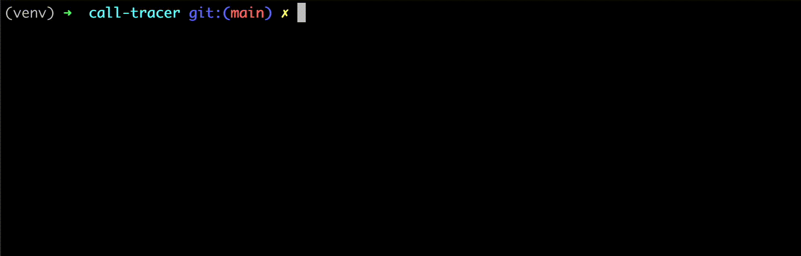

# call-tracer

```call-tracer``` is a library for tracing function calls with depth control and filtering.

<br/>

<br/>


## Installation

```bash
pip install call-tracer
```

(Required: python >= 3.6)

<br/>

<br/>

## Usage

### Basic Usage

```python
from calltracer import tracer

def add_one(n):
    return n+1

def add_two(n):
    n = add_one(n)
    n = add_one(n)
    return n

@tracer
def main():
    n = add_two(4)

main()
```



<br/>

<br/>

### Customizations

If you want to use `tracer` to monitor the internal workings of [langchain](https://github.com/langchain-ai/langchain), you'll encounter a tremendous number of calls and returns, each accompanied by very long file paths. Therefore, you may need to customize the `tracer` slightly:

```python
from langchain_core.prompts import ChatPromptTemplate, MessagesPlaceholder
from calltracer import tracer
tracer.set_max_depth(3)
tracer.set_path_cuts(['python3.9'])
tracer.set_path_filters(['pydantic'])


@tracer
def main():
    prompt = ChatPromptTemplate.from_messages([
        ("system", f"You are a helpful assistant"),
        MessagesPlaceholder(variable_name="chat_history"),
        ("user", "{input}")
    ])

main()
```


- `set_max_depth` : Set the maximum depth for tracing. (prints `depth` <= `max_depth`)
- `set_path_cuts` : Specify paths to be shortened in the trace output to simplify and clean up the displayed file paths in the trace logs. 
  - For example, if you use `trace.set_path_cuts(['PythonProjects'])`, the path `/Users/your_name/PythonProjects/your_project/sample.py` will be shortened to `your_project/sample.py`.
- `set_path_filters` : Specify paths to be excluded from tracing, preventing the trace function from logging calls and returns for files matching these paths.

<br/>

<br/>

## Contributing

- Pull requests are welcome. 
  - For major changes, please open an issue first to discuss what you would like to change. 
  - Please make sure to update tests as appropriate.

<br/>

<br/>

## License

[MIT](https://choosealicense.com/licenses/mit/)